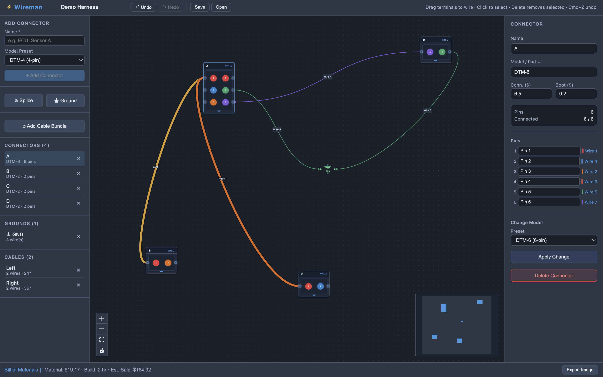

# Wireman

A desktop application for designing automotive wiring harnesses. Build connector diagrams visually, generate a bill of materials, and estimate build cost and time.



## Features

- **Visual canvas** — drag connectors onto a canvas and draw wires between pins
- **Connector library** — Deutsch DTM and DT series presets (2–12 pin); fully custom connectors supported
- **Wire bundles / cables** — group wires into a shared cable with a single length
- **Splices & junctions** — multi-wire splice nodes for branching circuits
- **Ground points** — chassis ground nodes that accept unlimited wires
- **Bill of Materials** — live-updating BOM with material cost, estimated build time, and sale price
- **CSV export** — export the BOM for quoting or ordering
- **Save / Open** — harness files saved as `.wireman` JSON; project name pre-fills the filename
- **Undo / Redo** — 50-step history (Cmd/Ctrl+Z / Cmd/Ctrl+Shift+Z)
- **Keyboard shortcuts** — Delete to remove selected items, Cmd+S to save, Cmd+O to open

## Getting started

### Prerequisites

- Node.js 18 or later
- npm 8 or later

### Run in development

```bash
npm install
npm run dev
```

The app window opens automatically. Changes to source files hot-reload without restarting.

### Build a distributable

```bash
npm run package
```

| Platform | Output |
|----------|--------|
| macOS    | `dist/Wireman-<version>-arm64.dmg` |
| Windows  | `dist/Wireman Setup <version>.exe` |
| Linux    | `dist/Wireman-<version>.AppImage`  |

See [BUILDING.md](BUILDING.md) for full build instructions and troubleshooting.

## Usage

### Building a harness

1. **Add connectors** — use the sidebar presets or enter a custom part number and pin count
2. **Wire pins** — drag from a pin handle on one connector to a pin handle on another; wires can also loop back to the same connector
3. **Add splices** — use ⊕ Splice for branch points where multiple wires meet
4. **Add grounds** — use ⏚ Ground for chassis ground connections (accepts unlimited wires)
5. **Create cable bundles** — use ⌬ Add Cable Bundle, then assign wires to it via each wire's properties panel; all wires in a bundle share one physical length
6. **Inspect / edit** — click any wire, connector, splice, or cable to edit its properties in the right panel
7. **Change connector model** — select a connector and use the "Change Model" section at the bottom of its properties; wired pins are preserved, shrinking below the connected pin count is blocked
8. **Review BOM** — the bar at the bottom updates live; click to expand the full table or export to CSV
9. **Save** — Cmd+S or the Save button; the project name is used as the default filename

### Keyboard shortcuts

| Shortcut | Action |
|----------|--------|
| Cmd/Ctrl+Z | Undo |
| Cmd/Ctrl+Shift+Z | Redo |
| Cmd/Ctrl+S | Save |
| Cmd/Ctrl+O | Open |
| Delete | Remove selected wire / connector / splice / ground |

## File format

Harness files are plain JSON with a `.wireman` extension:

```json
{
  "version": 1,
  "projectName": "My Harness",
  "connectors": [...],
  "wires": [...],
  "cables": [...],
  "splices": [...],
  "grounds": [...]
}
```

Files are forward-compatible: newer builds add optional fields with safe defaults, so old files always open. A version bump is only required when fields are renamed, removed, or structurally changed.

## Project structure

```
src/
  main/           Electron main process — window, IPC, file dialogs
  preload/        Context bridge — exposes window.api to the renderer
  renderer/src/
    models/       Domain types, factories, BOM generation, validation
    store/        Zustand state — all harness data + undo/redo history
    components/
      canvas/     React Flow nodes (connector, splice, ground) and canvas
      sidebar/    Add-connector form and entity lists
      properties/ Properties panel for selected items
      bom/        Bill of Materials panel and CSV export
```

## Tech stack

- [Electron](https://www.electronjs.org/) + [electron-vite](https://evite.netlify.app/)
- [React 18](https://react.dev/) + TypeScript
- [@xyflow/react](https://reactflow.dev/) (React Flow v12) — canvas
- [Zustand](https://zustand-demo.pmnd.rs/) — state management
- [nanoid](https://github.com/ai/nanoid) — ID generation
